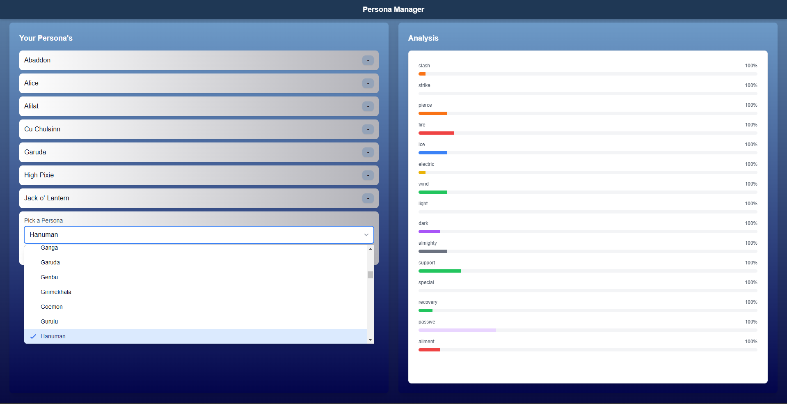

# 🎭 Persona Manager

A desktop application built with **React**, **Django**, and **Electron** for managing Personas from *Persona 3 Reload*. Browse, add, and organize your team using an intuitive local interface.

---

## 📦 Features

- 🔍 Search and filter Personas
- ➕ Add Personas to your team
- 📊 View attack element distrabution
- 🗃️ Local database powered by Django + SQLite
- ⚡ Fully offline, runs as a desktop app

---

## 🚀 How to Install (Windows Only)

### 🖱️ One-Click Installer (Recommended)

> ✅ **No setup needed** — just download and run!

1. Go to the [**Releases**](https://github.com/Masterslayer7/Persona-Manager-Windows/releases/tag/v1.0.0) page
2. Download the latest `Persona.Manager.Setup.1.0.0.exe` file
3. Run the installer
4. Launch **Persona Manager** from your desktop or start menu

🎉 That’s it! The Django backend will launch in the background automatically, and the React app will open in a window.

---

## 🛠 Requirements (For Manual Setup / Dev Mode)

If you are a developer or want to run the project manually:

- [Python 3.10+](https://www.python.org/downloads/)
- [Node.js + npm](https://nodejs.org/)
- Git

---

## 🧪 Run from Source (Dev Mode)

1. **Clone the repository**:

```bash
git clone https://github.com/your-username/personaManager.git
cd personaManager
```


## 🖼️ Screenshots

> Here's a preview of the app in action:

### 🎯 Main UI


### 🔎 Persona Search


---

## ❓ FAQ

**Q: Do I need Python to use the `.exe`?**  
**A:** No — Python is only needed for developers. The `.exe` includes everything.

**Q: Is internet required to run the app?**  
**A:** Nope! It works completely offline.

**Q: Where is my data saved?**  
**A:** Data is saved locally using SQLite. It’s stored within the app's runtime directory.

---

## 🤝 Contributing

Pull requests and feedback are welcome!  
If you’d like to add features, fix bugs, or help improve the UI, feel free to:

1. Fork the repository
2. Create a new branch (`git checkout -b feature-name`)
3. Commit your changes (`git commit -am 'Add feature'`)
4. Push to your fork (`git push origin feature-name`)
5. Submit a pull request 🚀

---